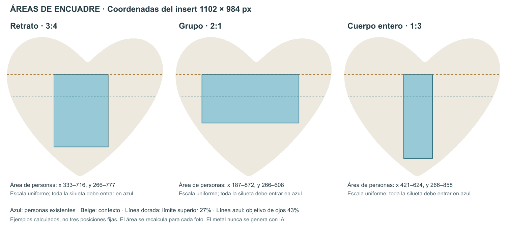

# Áreas de personas y generación de contexto

La foto nítida se encaja en contain al mayor rectángulo del hueco. El resto del corazón lo llena un cover desenfocado de la misma foto. El marco de oro se superpone al final.

## Coordenadas

| Sistema | Dimensiones | Origen |
| --- | --- | --- |
| PNG del producto | 1536 × 1024 px | Esquina superior izquierda de `public/reli.png` |
| Rectángulo que contiene el hueco | 551 × 492 px | `(847, 345)` en el PNG del producto |
| Insert de trabajo | 1102 × 984 px | Esquina superior izquierda del rectángulo del hueco, a escala 2× |

Todas las medidas siguientes son del **insert de trabajo**. Conversión al producto: `xPNG = 847 + xInsert / 2`, `yPNG = 345 + yInsert / 2`. No usar las medidas del producto como si fueran el área de la foto.

El hueco es un corazón asimétrico, no un rectángulo. Su contorno se obtiene del canal alpha de `reli.png`. Los límites horizontales se recalculan por fila: la punta inferior y la hendidura central no son zonas seguras para caras.

## Dónde colocar a las personas

| Zona | Regla del código | Uso |
| --- | --- | --- |
| Franja superior | Desde 0 hasta 27% del alto (`y < 266`) | Contexto: cielo, pared, vegetación u otro fondo de la escena. Evitar cabezas y caras bajo la hendidura. |
| Borde superior de la silueta | Como mínimo 27% (`y = 266`) y siempre bajo la hendidura real + margen | Inicio de las personas; deja aire entre el pelo y el metal. |
| Ojos / centro estimado de cara | Objetivo: 43% (`y ≈ 423`) | Preferencia de composición. Se desplaza si es necesario para conservar todo el grupo dentro del área segura. |
| Personas completas | Rectángulo adaptado a su proporción; borde inferior seleccionado entre 50% y 90% | Mantener dentro de este rectángulo la silueta detectada de todas las personas. |
| Distancia al metal | 3,5% del lado menor: **35 px** en el insert | Evitar que caras, pelo y cuerpos se apoyen en los bordes. |
| Lóbulos, laterales y punta libres | Todo el hueco que quede fuera de la foto | Completar contexto, nunca ubicar una persona nueva para llenar el espacio. |

El área no es fija para todas las fotos: se evalúan rectángulos contenidos en la máscara real, con margen, y se elige el que admite la mayor escala uniforme para el sujeto. En grupos se conserva la distancia relativa entre las personas. Nunca se estira un eje por separado ni se mueve a cada persona independientemente.

### Ejemplos medidos

Estos ejemplos usan la **proporción de la silueta**, no la proporción del archivo subido. Los intervalos son límites geométricos, con redondeo de hasta un píxel al rasterizar.

| Proporción de la silueta | Área X del insert | Área Y del insert | Tamaño seguro |
| --- | --- | --- | --- |
| Retrato 3:4 | 333–716 | 266–777 | 383 × 511 px |
| Grupo horizontal 2:1 | 187–872 | 266–608 | 685 × 342 px |
| Cuerpo entero 1:3 | 421–624 | 266–858 | 203 × 592 px |

La foto encuadrada se pone en cover del hueco, con su fondo original. Sin blur ni viñeta.

## Hueco sin foto

No se genera fondo con IA. El lienzo se pinta marfil `#F3EDE4` y se pega la foto original. Una sola llamada: `bria/remove-background`, solo para encuadrar.

## Archivos y comprobaciones

- `src/lib/relicario-spec.ts`: dimensiones, márgenes y modelo de recorte.
- `src/lib/relicario-mask.ts`: máscara real y selección de zona segura.
- `src/lib/relicario-frame.ts`: escala y posición del conjunto.
- `tests/relicario.test.mjs`: conservación del original, zonas de encuadre y marfil.

El esquema está disponible en [SVG](relicario-zonas.svg). Al cambiar el PNG o los márgenes, volver a medir y actualizar estos ejemplos y el esquema.
